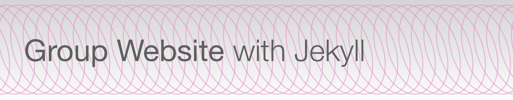

Start `_includes/banner.md`
[]((https://JulianKarlBauer.github.io/group-website/))
[](https://JulianKarlBauer.github.io/group-website/)
End `_includes/banner.md`

```
Start `_includes/banner.md`
[]((https://JulianKarlBauer.github.io/group-website/))
[](https://JulianKarlBauer.github.io/group-website/)
End `_includes/banner.md`
```
